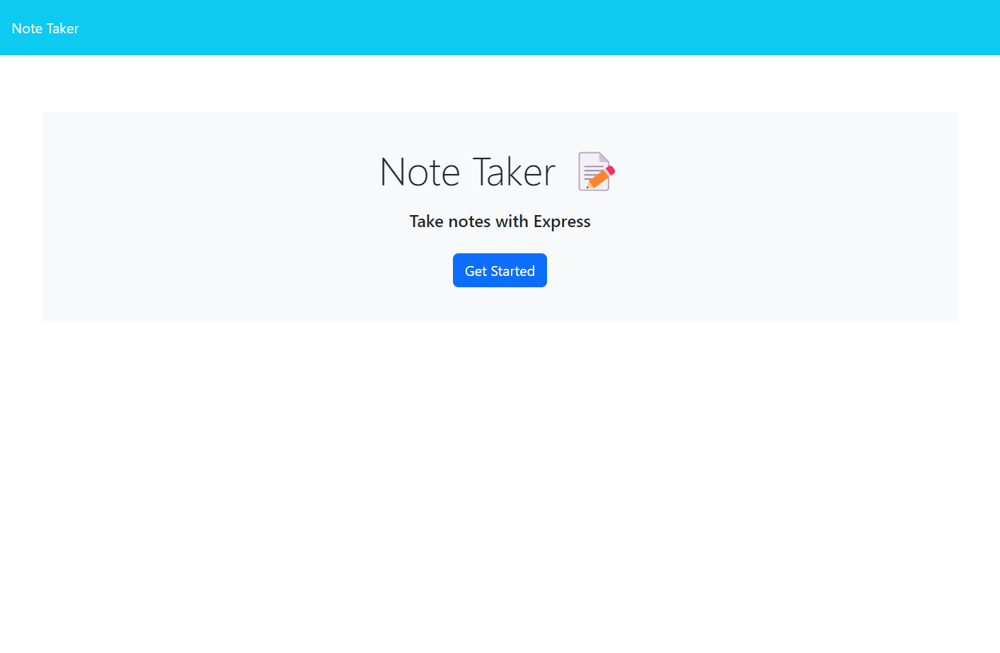
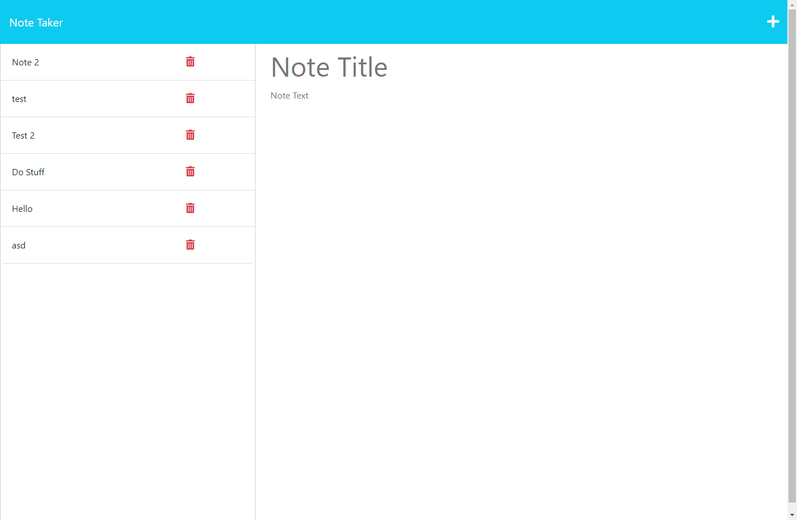

# Note Taker Challenge	
## Description
This project is a note taker where the user can add edit or delete existing notes and add new notes. The app uses express to access the database of notes and path around with each button click.
## Table of Contents
- [Installation](#installation)
- [Usage](#usage)
- [Credits](#credits)
- [License](#license)
- [Questions](#questions)
- [Tests](#tests)
## Installation
The pertinent files for the project, including this README can all be found in the Github repository located at: https://github.com/mhalder4/note-taker-challenge. The website can be found at the Heroku address that follows: https://mhalder-note-taker-challenge-5cda22b36b1b.herokuapp.com/.
## Usage
Along the left of the webpage, there are all the existing notes along with a trash can button to delta a note if desired. Upon clicking on a note, the contents pop up on the right side of the screen where they can be edited. A plus sign in the upper right can also be used to create a new note with blank entry fields. Upon editing a new or existing note, a save button in the upper right can be clicked to save the note to the database. A note can only be saved if both text fields have text in them.

## Credits
A boilerplate file created by me, with the assitance of my instructor during class time, was used as a template for many of the routes.
## License
[MIT License](https://choosealicense.com/licenses/mit/)
MIT License

Copyright (c) 2023 Matthew Halder

Permission is hereby granted, free of charge, to any person obtaining a copy
of this software and associated documentation files (the "Software"), to deal
in the Software without restriction, including without limitation the rights
to use, copy, modify, merge, publish, distribute, sublicense, and/or sell
copies of the Software, and to permit persons to whom the Software is
furnished to do so, subject to the following conditions:

The above copyright notice and this permission notice shall be included in all
copies or substantial portions of the Software.

THE SOFTWARE IS PROVIDED "AS IS", WITHOUT WARRANTY OF ANY KIND, EXPRESS OR
IMPLIED, INCLUDING BUT NOT LIMITED TO THE WARRANTIES OF MERCHANTABILITY,
FITNESS FOR A PARTICULAR PURPOSE AND NONINFRINGEMENT. IN NO EVENT SHALL THE
AUTHORS OR COPYRIGHT HOLDERS BE LIABLE FOR ANY CLAIM, DAMAGES OR OTHER
LIABILITY, WHETHER IN AN ACTION OF CONTRACT, TORT OR OTHERWISE, ARISING FROM,
OUT OF OR IN CONNECTION WITH THE SOFTWARE OR THE USE OR OTHER DEALINGS IN THE
SOFTWARE.
## Questions
Find me on [GitHub](https://github.com/mhalder4)
## Tests
N/A